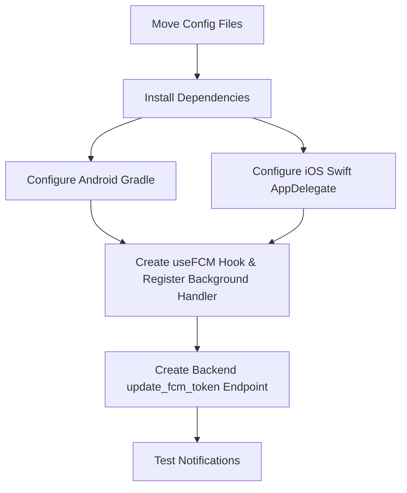

# Firebase Cloud Messaging (FCM) Integration Plan

This document outlines the step-by-step implementation plan for integrating FCM into the **Meds** mobile application (React Native) and its backend (Python/Frappe).

---

## 📅 High-Level Roadmap



---

## 📂 Phase 1: Move Configuration Files to Proper Places

Currently, the two downloaded configuration files are sitting in the root of the project. We will move them to their required native folders:

1. **Android config:**
   * Move from: `/google-services.json`
   * Move to: `/android/app/google-services.json`
2. **iOS config:**
   * Move from: `/GoogleService-Info.plist`
   * Move to: `/ios/GoogleService-Info.plist`
   * *Note: The iOS file will also need to be linked inside Xcode (`Meds.xcworkspace`) under the target project group.*

---

## 📱 Phase 2: Mobile App (React Native) Setup

### 1. Install Dependencies
Add the native Firebase modules to `package.json`:
* `@react-native-firebase/app`
* `@react-native-firebase/messaging`

```bash
npm install @react-native-firebase/app @react-native-firebase/messaging
# For iOS:
cd ios && pod install && cd ..
```

---

### 2. Configure Android Native Build Files

#### A. Modify `/android/build.gradle`
Add the Google Services dependency classpath to `buildscript.dependencies`:
```gradle
dependencies {
    classpath("com.android.tools.build:gradle")
    classpath("com.facebook.react:react-native-gradle-plugin")
    classpath("org.jetbrains.kotlin:kotlin-gradle-plugin")
    classpath("com.google.gms:google-services:4.4.1") // <-- ADD THIS
}
```

#### B. Modify `/android/app/build.gradle`
Apply the plugin right below the React native plugin application:
```gradle
apply plugin: "com.android.application"
apply plugin: "org.jetbrains.kotlin.android"
apply plugin: "com.facebook.react"
apply plugin: "com.google.gms.google-services" // <-- ADD THIS
```

---

### 3. Configure iOS Swift Native Files

#### A. Modify `/ios/Meds/AppDelegate.swift`
Initialize Firebase inside your Swift-based AppDelegate.

```swift
import UIKit
import React
import React_RCTAppDelegate
import ReactAppDependencyProvider
import Firebase // <-- ADD THIS

@main
class AppDelegate: UIResponder, UIApplicationDelegate {
  var window: UIWindow?

  var reactNativeDelegate: ReactNativeDelegate?
  var reactNativeFactory: RCTReactNativeFactory?

  func application(
    _ application: UIApplication,
    didFinishLaunchingWithOptions launchOptions: [UIApplication.LaunchOptionsKey: Any]? = nil
  ) -> Bool {
    FIRApp.configure() // <-- ADD THIS at the very start of the method

    let delegate = ReactNativeDelegate()
    let factory = RCTReactNativeFactory(delegate: delegate)
    delegate.dependencyProvider = RCTAppDependencyProvider()

    reactNativeDelegate = delegate
    reactNativeFactory = factory

    window = UIWindow(frame: UIScreen.main.bounds)

    factory.startReactNative(
      withModuleName: "Meds",
      in: window,
      launchOptions: launchOptions
    )

    return true
  }
}
```

---

### 4. Implement Firebase Messaging in React Native

#### A. Create Custom React Hook `/src/shared/hooks/useFCM.ts`
This hook will handle permission requests, token generation, uploading the token to the server upon login, and handling foreground message banners:

```typescript
import { useEffect } from 'react';
import { Platform, Alert } from 'react-native';
import messaging from '@react-native-firebase/messaging';
import { useAppSelector } from '../../app/hooks';
import { authService } from '../../features/authentication/services/authService';

export const useFCM = () => {
  const { isAuthenticated, session } = useAppSelector(state => state.auth);

  useEffect(() => {
    const setupFCM = async () => {
      // 1. Request Notification Permissions
      const authStatus = await messaging().requestPermission();
      const enabled =
        authStatus === messaging.AuthorizationStatus.AUTHORIZED ||
        authStatus === messaging.AuthorizationStatus.PROVISIONAL;

      if (enabled) {
        console.log('FCM Notification permission granted.');
        
        try {
          // 2. Fetch the registration token
          const token = await messaging().getToken();
          console.log('FCM Token:', token);

          // 3. Upload token to Python server if authenticated
          if (isAuthenticated && session?.email && token) {
            const deviceType = Platform.OS === 'ios' ? 'ios' : 'android';
            await authService.uploadFCMToken(session.email, token, deviceType);
          }
        } catch (error) {
          console.error('Error fetching FCM Token:', error);
        }
      }
    };

    if (isAuthenticated) {
      setupFCM();
    }

    // 4. Handle Foreground Messages
    const unsubscribeForeground = messaging().onMessage(async remoteMessage => {
      Alert.alert(
        remoteMessage.notification?.title || 'Notification',
        remoteMessage.notification?.body || ''
      );
    });

    return () => {
      unsubscribeForeground();
    };
  }, [isAuthenticated, session]);
};
```

#### B. Modify `/src/features/authentication/services/authService.ts`
Add the function to submit the token to your Frappe backend:
```typescript
const UPLOAD_FCM_TOKEN_URL = `${API_BASE_URL}api/method/erp_pharmacy.api.user_auth.update_fcm_token`;

export const authService = {
  // ... existing methods ...

  uploadFCMToken: async (email: string, token: string, deviceType: 'android' | 'ios'): Promise<boolean> => {
    try {
      const response = await fetch(UPLOAD_FCM_TOKEN_URL, {
        method: 'POST',
        headers: {
          Accept: 'application/json',
          'Content-Type': 'application/json',
        },
        body: JSON.stringify({
          email,
          fcm_token: token,
          device_type: deviceType,
        }),
      });
      return response.ok;
    } catch (error) {
      console.error('Failed to upload FCM Token to backend:', error);
      return false;
    }
  }
};
```

#### C. Register Background Handler in `/index.js`
Background message listeners must be initialized at the top level outside components.
```javascript
import 'react-native-gesture-handler';
import { AppRegistry } from 'react-native';
import messaging from '@react-native-firebase/messaging';
import App from './App';
import { name as appName } from './app.json';

// Handle background messages
messaging().setBackgroundMessageHandler(async remoteMessage => {
  console.log('Message handled in the background!', remoteMessage);
});

AppRegistry.registerComponent(appName, () => App);
```

#### D. Bootstrap in `/App.tsx`
Call the hook inside the `AppShell` component:
```typescript
import { useFCM } from './src/shared/hooks/useFCM';

const AppShell = () => {
  const mode = useAppSelector(state => state.settings.themeMode);
  const systemScheme = useAppSelector(state => state.settings.systemScheme);
  const theme = resolveTheme(mode, systemScheme);

  // Initialize FCM logic
  useFCM();

  return (
    <SafeAreaProvider>
      <StatusBar
        barStyle={theme.dark ? 'light-content' : 'dark-content'}
        backgroundColor={theme.colors.background}
      />
      <AuthBootstrapGate />
    </SafeAreaProvider>
  );
};
```

---

## 🐍 Phase 3: Backend Setup (Frappe Framework / Python)

1. **Create DocType `User FCM Token`**:
   * Fields: `user` (Link to User), `fcm_token` (Small Text), `device_type` (Select).
2. **API Endpoint (`erp_pharmacy/api/user_auth.py`)**:
   * Create a whitelisted function to insert/update the FCM token for the session user in the database.
3. **Install Server Admin SDK**:
   * Run `pip install firebase-admin` in your server environment.
4. **Notification Script**:
   * Initialize using your generated `service-account.json` file.
   * Add a `send_push_notification(user_id, title, body, data)` script utilizing `firebase_admin.messaging.MulticastMessage` to send background triggers.

---

## 🔍 Verification & Testing Plan
* **Android Build Verification:** Execute `npx react-native run-android` to ensure compile-time gradle changes don't disrupt your builds.
* **iOS Build Verification:** Run `cd ios && pod install` to ensure Firebase pods are bundled successfully.
* **FCM Registration:** Verify in console logs that an FCM Token is printed out and submitted to the API when logged in.
